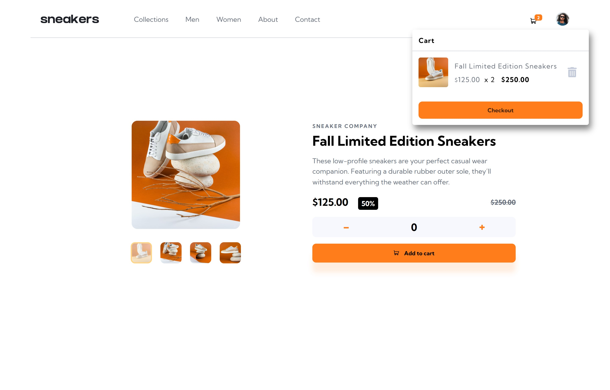

# Frontend Mentor - E-commerce product page solution

This is a solution to the [E-commerce product page challenge on Frontend Mentor](https://www.frontendmentor.io/challenges/ecommerce-product-page-UPsZ9MJp6). Frontend Mentor challenges help you improve your coding skills by building realistic projects.

## Table of contents

- [Overview](#overview)
  - [The challenge](#the-challenge)
  - [Screenshot](#screenshot)
  - [Links](#links)
  - [Built with](#built-with)
  - [What I learned](#what-i-learned)
  - [Continued development](#continued-development)
  - [Useful resources](#useful-resources)
- [Author](#author)

## Overview

This ecommerce product page is an excellent opportunity to put my JS skills to the test with a lightbox product gallery and cart functionality!

### The challenge

Users should be able to:

- View the optimal layout for the site depending on their device's screen size
- See hover states for all interactive elements on the page
- Open a lightbox gallery by clicking on the large product image
- Switch the large product image by clicking on the small thumbnail images
- Add items to the cart
- View the cart and remove items from it

### Screenshot

### Links

- Solution URL: [Add solution URL here](https://github.com/remainhumble/E-commerce-product-page)
- Live Site URL: [Add live site URL here](https://remainhumble.github.io/E-commerce-product-page/#)

### Built with

- Semantic HTML5 markup
- CSS custom properties
- Flexbox
- Mobile-first workflow

### What I learned

Throughout this project, I deepened my understanding of responsive web design, particularly using CSS Grid and Flexbox together for complex layouts. I learned how to structure semantic HTML for accessibility and how to use CSS custom properties for easier theme management. Additionally, I improved my workflow by adopting a mobile-first approach.

### Continued development

In future projects, I want to continue focusing on:

- Deepening my understanding of advanced CSS Grid and Flexbox layouts for more complex responsive designs.
- Improving accessibility by learning more about ARIA roles and best practices for inclusive web development.
- Refining my use of CSS custom properties for scalable and maintainable theming.
- Exploring component-based design systems to streamline development and ensure consistency across projects.
- Experimenting with modern CSS features like container queries and logical properties as browser support improves.

### Useful resources

- [How to make Incremental and Decremental counter using HTML, CSS and JavaScript ?](https://www.geeksforgeeks.org/javascript/how-to-make-incremental-and-decremental-counter-using-html-css-and-javascript/) - This helped me build the counter feature to increment and decrement the number of pairs of sneakers.
- [Build this image slider with JavaScript!](https://www.youtube.com/watch?v=749ta0nvj8s&t=703s) - This is an image slider program that you can create as a beginner. We will be using element selectors to create a nodelist of images to cycle through. An image to be displayed will have a class added to their classList that contains display: block. You will need at least a few images of your choosing to work with. I recommend image that are roughly the same size.
- [Create a Shopping Cart With Vanilla JavaScript | ES6](https://youtu.be/UcrypywtAm0?si=F0K9kcNhydX0Phyz) - This video shows how to Create a Shopping Cart With Vanilla JavaScript.

## Author

- Frontend Mentor - [@remainhumble](https://www.frontendmentor.io/profile/remainhumble)
